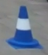
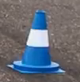
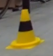
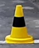
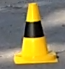
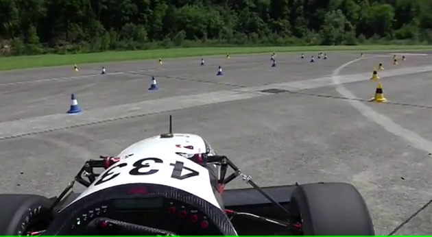

# Cone Tracking
This repository contains the code for the KTH Formula Student senior recruitment exercises.

### -`Data`
In the data folder all the videos and images provided by KTH Formula Student can be found

Single cones examples:

Video examples:

### -`Singe_cone_classifier_(exc1)`
In this folder the all code related to the first exercise can be found:

_Design and implement a classical computer vision algorithm which can read all images of the folder and determine
their colour._

/Classification_matplot.png)

### -`multiple_cones_tracking(exc2)`
In this folder the all code related to the second exercise can be found:

_The task is to detect cones from these videos by drawing bounding boxes over them and putting a text over the bounding box indicating their label (i.e. their colour)_

/multiple_cones_tracking/videos/images/demo.jpg)

### -`utils`
This folder contains helper scripts