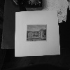
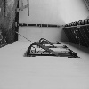
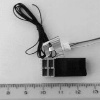
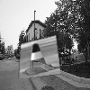

# Cascade Classifier training
This directory contains most files used when training the cascade classifiers. 
The training was completed with opencv's traincascade script. The traing was completed
on a cluster of HP ProLiant SL230s LHS G8-V1 nodes running ubuntu 20.04.

### Training data
The training data was collected from KTH Formula Student's provided cone images and a kaggles 
repository of negative images ([Kaggle](https://www.kaggle.com/muhammadkhalid/negative-images)).
 
Example Postives:

Example Negatives:

### Training process
First the training samples hade to be generated which was done with the `opencv_createsamples`. 
This opencv module combined the negatives with the positives and generated images like this:

These images were then feed through the `opencv_traincascade` module which used took in
all the generated data and the negative images to train a cascade classifier.

### Workspace Structure
- `generate_neg_pos.py`
  - The script used to collect, preprocess and structure the traingdata
- `model_tester.py`
  - A simple script used to test trained cascades on the KTH Formula Student images
- `node_status.py`
  - A script used to get status of the training progress on some of the nodes.
- `training_log.txt`
  - A list of the tracked training commands
- `opencv_ws`
  - The folder containg all unprocessed traing data
- `training_deployment_<width>x<height>`
  - Folders containg all the processed and generated training data which were copied to the nodes when training started