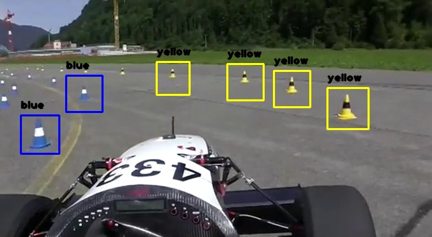

# Multiple Cone Tracking
This implementation of cone tracking utilizes a custom-trained haar casacde classifier, hsv color filtering and optical flow.

### Requirements
To be able to run the main (`main.py`) script, install the required pip packages with `pip install -r requirements.txt`. The main script is only tested on MacOS, but might run on other UNIX systems or Windows as well.

### Start the tracking
To start tracking cones the important script is `main.py`. This script needs to be executed with python3.7+ in the `multiple_cone_tracking` directory for all the dependencies to work correctly. In the `main.py` script there are also a set of hyperparameters contained in global variables at the top of the script which can be adjusted to run different streams, improve tracking, save stream, etc.

### Workspace Structure
- `main.py`
  - The executable start script for tracking cones.
  - Contains all the hyperparameters.
- `FrameManager/FrameManager.py`
  - A utility class for processing the frames. 
  - E.g. place text or rectangles in the frame.
- `FlowOptics/FlowOptics.py`
  - A class for processing optical flow between images.
- `ConeManager/ConeManager.py`
  - Containes the dataclass `Cone` that defines a cone and its attributes.
  - Containers the class `ConeManager` that keeps track of all the detected cones.
- `ConeClassifier/ConeClassifier.py`
  - Classifies cones based on their placement in the frame. 
  - Relies on `ColorMasker`
- `ColorMasker/ColorMasker.py`
  - A class that deals with color filtering and masking.
- `CascadeClassifier/CascadeClassifier.py`
  - A class that employ a pretrained cascade classifier to detect cones from frames.
- `CascadeClassifier/trained_cascades.py`
  - A directory containing all the custom trained cascade classifiers XML files along with their parameters,
- `videos`
  - Contains videos of cone tracking with different hyperparameters