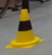

# Single Cone Classification
The code in this folder implements simple HSV filtering to determine color of the provided cone images.

Cone image examples:

### Requirements
To be able to run the main (`cone_classifier.py`) script, install the required pip packages with 
`pip install -r requirements.txt`. The main script is only tested on MacOS, but might run on other 
UNIX systems or Windows as well.

### Visualization and Benchmarking
When running the `cone_classifier.py` it will bring up a matplot which displays the different
color filters. With the current configuration the plot looks like this:

The first row of images displays the original image. Below that is first the blue HSV mask and below that the yellow 
HSV mask.

With current configuration it classifies all images correctly.